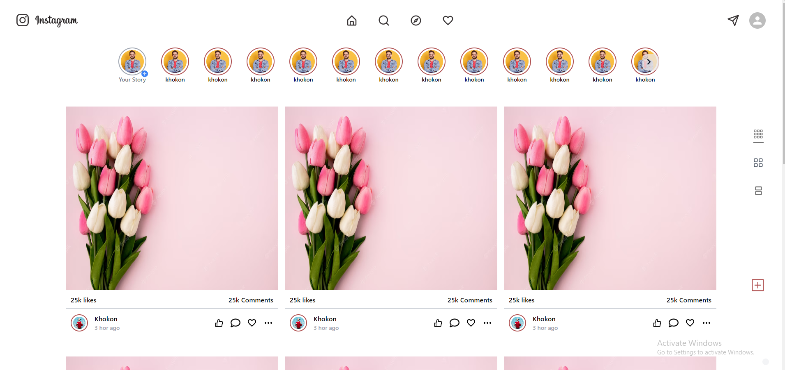
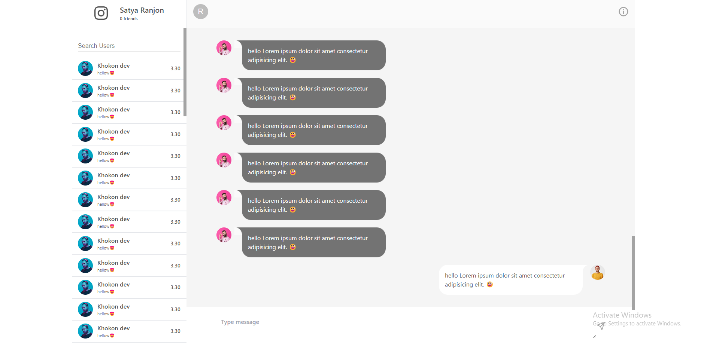

# Satya Ranjon

## _Instagram clone -v1.0_

## <a href="https://instagram-ui-six.vercel.app/"> Live.....</a>

## 🖥️ Tech Stack

[](https://skills.thijs.gg)

<div align="center">
  
  
  
</div>

## Installation

Install the dependencies and devDependencies and start the server.

```sh
cd instagram-ui
npm i
npm start
OR
yarn install
yarn start
```
